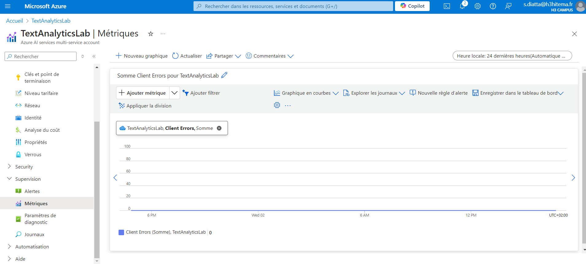
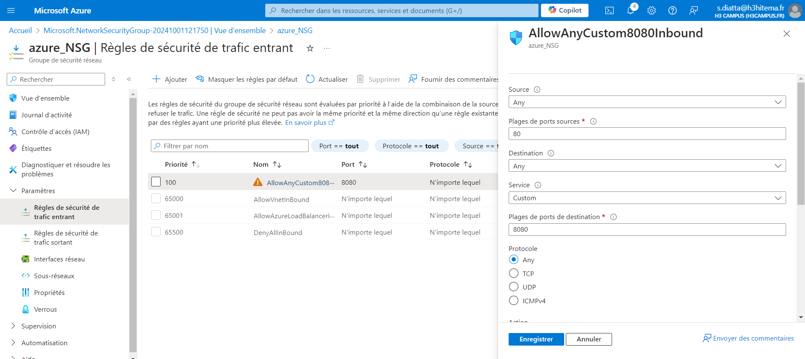
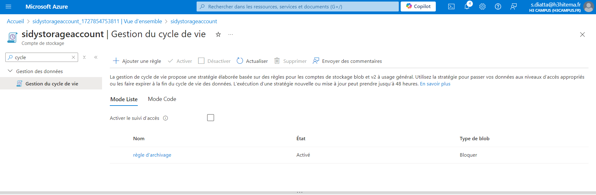
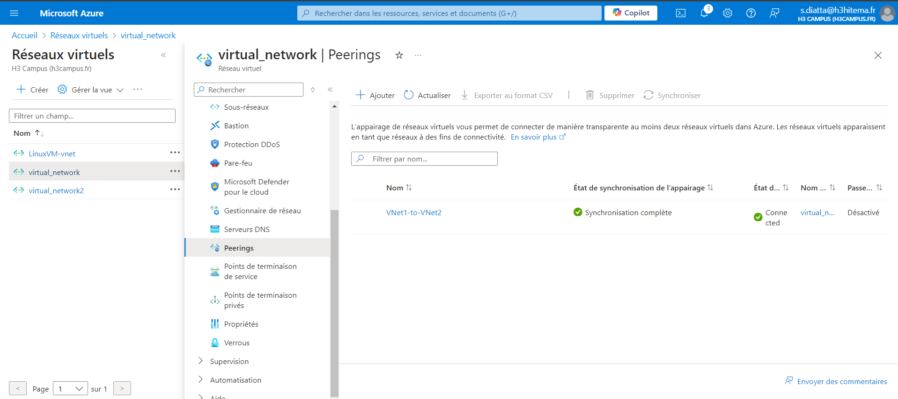

# Lab 2: Implémentation des Réseaux Virtuels Azure

### Objectifs
- Créer un Réseau Virtuel (VNet) avec plusieurs sous-réseaux.
- Configurer des Groupes de Sécurité Réseau (NSG) pour contrôler le trafic entrant et sortant.
- Déployer des VMs dans des sous-réseaux spécifiques.
- Configurer le Peering de VNet entre deux VNets.

### Étapes

#### 1. Créer un Réseau Virtuel (VNet)
- Accédez au portail Azure.
- Créez un VNet avec l'adresse IPv4 `10.0.0.0/16`.
- Ajoutez des sous-réseaux `10.0.1.0/24` et `10.0.2.0/24`.

#### 2. Configurer des Groupes de Sécurité Réseau (NSG)
- Créez un NSG.

- Ajoutez des règles pour contrôler le trafic.

#### 3. Déployer des VMs
- Créez des VMs dans les sous-réseaux.

#### 4. Configurer un pairing entre 2 reseaux virtuels
- Faire un pairing entre 2 VNETS.

