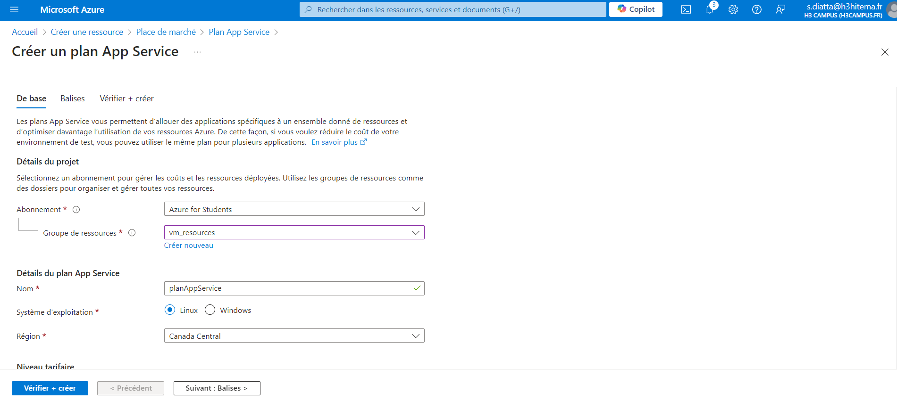
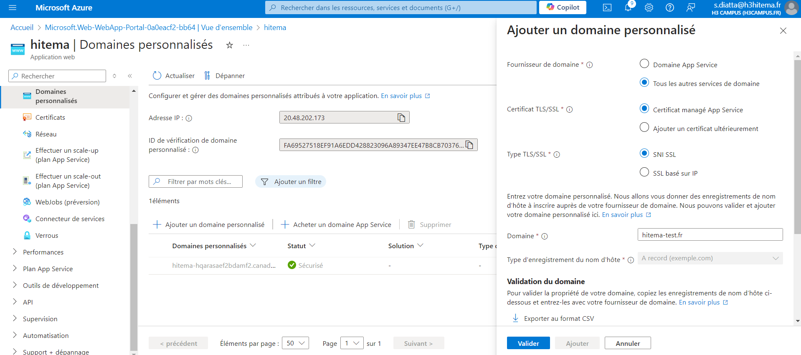

#  Lab 3 : Déployer des applications web avec Azure App Service

### Étapes

#### 1.  Création d'un App Service Plan 

#### 2. Déploiement d'une application web avec App Service

#### 3. Configuration de domaines personnalisés et certificats SSL
- Domaine personnalisé.

