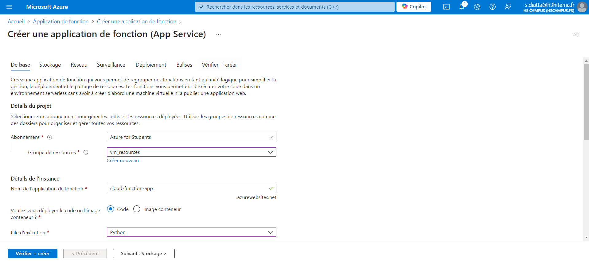
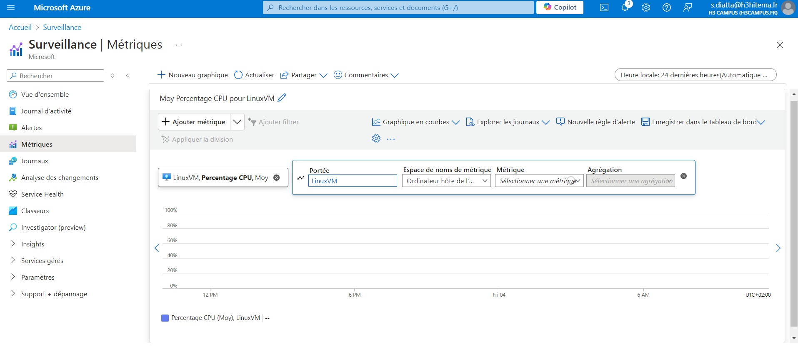
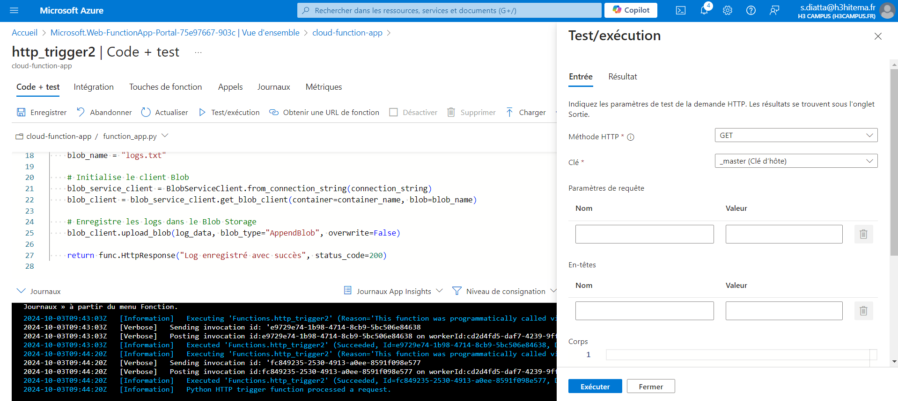

#  Lab 6 : Créer une ressource Azure Cognitive Services

### Étapes

#### 1.  Créer une ressource Cognitive Services

- Créer une ressource cognitive services

- Obtenir les clés d'API :

#### 2. Développer une application utilisant l'API Text Analytics

- Résultat : 

#### 3. Suivre l’utilisation de l’API et gérer les clés

